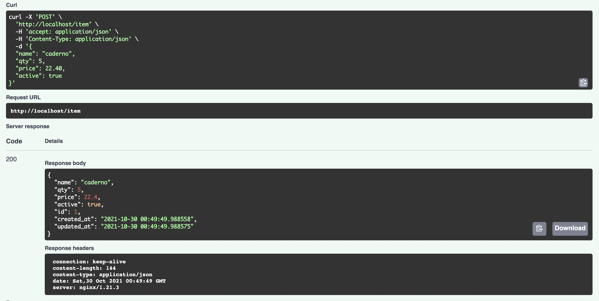
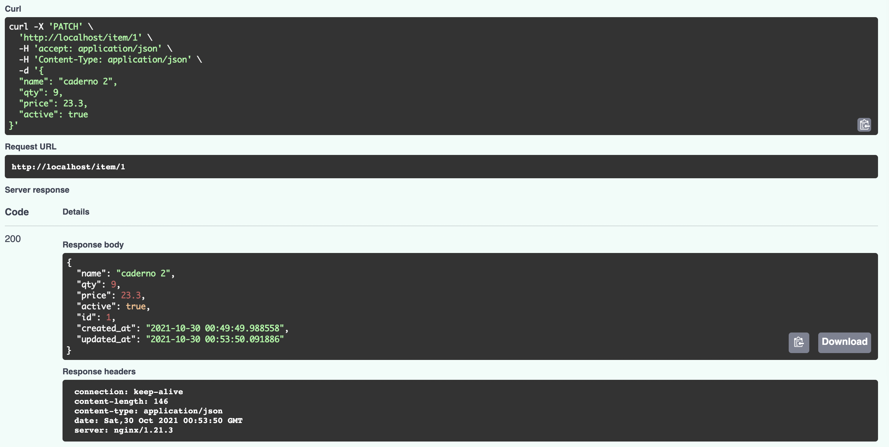
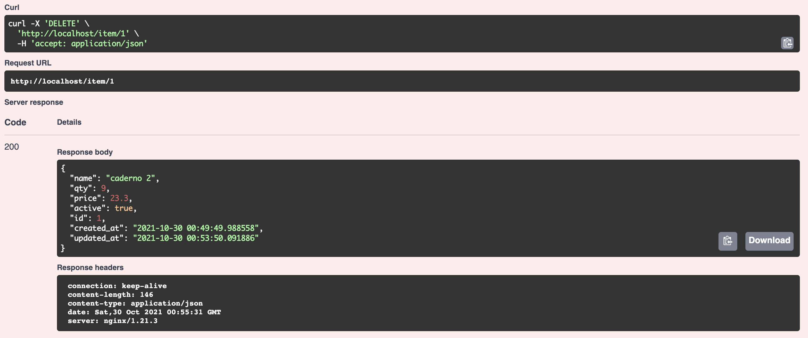
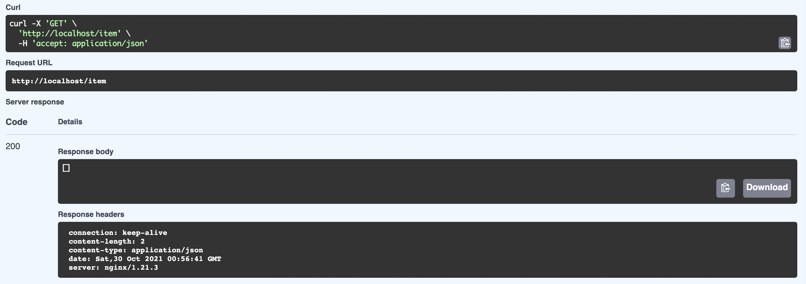

# AC5 - CRUD

# Tecnologias

- Docker Compose - Gerenciar a criação dos containers
- Docker - Engine de virtualização para criar container
- PostgreSQL - Banco de dados relacional
- Nginx - Proxy reverso
- Python FastAPI - Framework Web

# Docker-compose

O docker-compose que mantém os containers na mesma rede e criar o link entre eles, a conexão é realiza por tag depends_on.
Somente o nginx e o banco dão o expose em uma porta para o container.

O docker-compose é responsavél por coordenar o container, descrevi 3 serviços que iram rodar.

- app = com dependencia do container
- nginx = depende do container de app
- database = independente

# Dockerfile

Dentro do arquivo dockerfile coloquei as instruções de como deve ser criado o projeto, será listada as dependências declaradas no arquivo requirements.txt depois será copiado o backend que está na pasta app.

# Backend - Estrurado em MVC

Estruturei a pasta app da seguinte forma:

- config: Responsável buscar a variavel de ambiente com as informações do banco.
- controller: Tem o arquivo de item.py com as regras.
- model: Aqui é criada a conexão com o banco e o mapeamento da tabela através do ORM sqlalchemy.
- resource: Declaração dos endpoints
- schema: Arquivos de mapeamento e validações de tipos.
- main.py: Monta as partes do sistema através do init_app.

# Nginx

Dentro da pasta nginx tem dois arquivos, o dockerfile que é o arquivo que irá contruir a imagem do nginx e nginx.conf que tem a configuração para onde deve ser encaminhada as requisições e esperar as respostas.

# Para subir os containers

1 - Execute o comando abaixo no terminal.
docker-compose up --build

2 - Acesse a url abaixo pelo navegador.
localhost:80/docs

3 - Veja a documentação gerada via OpenAPI.

# Execuções

1 - POST

2 - GET

3 - PATCH

---

4 - DELETE

---

5 - GET após delete.

